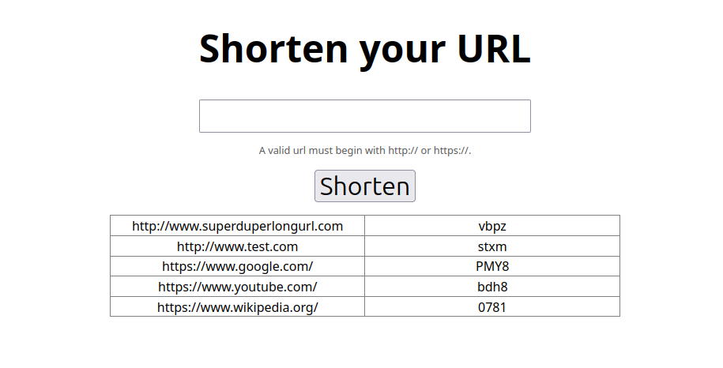

A small url shortener made with Python Flask.

The web is build with learning purposes, there are no garantees.

### Pending Changes:

- [x] Add a window showing last N urls.
- [x] Improve DB object managment.
- [x] Add validation to check that the original url is a url
- [x] Running app.py should check if the database exists and create it if not.
- [x] Improve this README.
- [x] Add a requirements.txt.
- [x] Correctly format the files. (Used [Black code formatter](https://black.readthedocs.io/en/stable/index.html) for the formatting. [](https://github.com/psf/black))

### How to use

Once the required packages are installed you can initialize the database with the command:

```bash
flask init-db
```

And then you can launch the web with:

```bash
flask run
```

